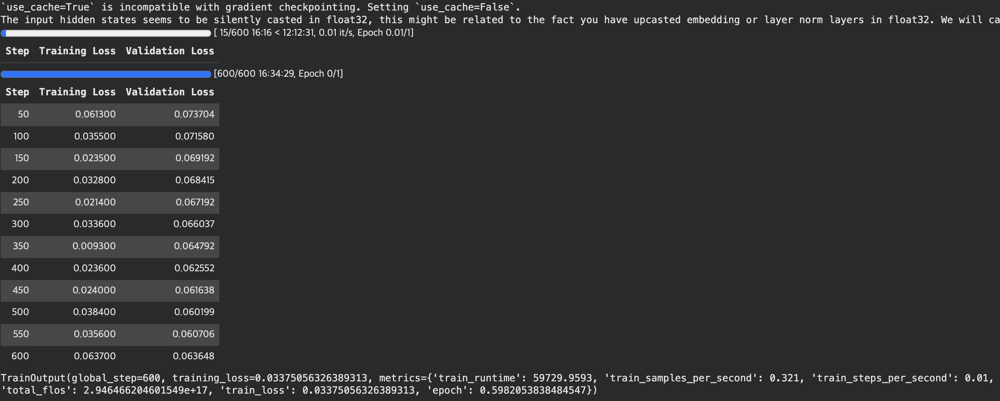
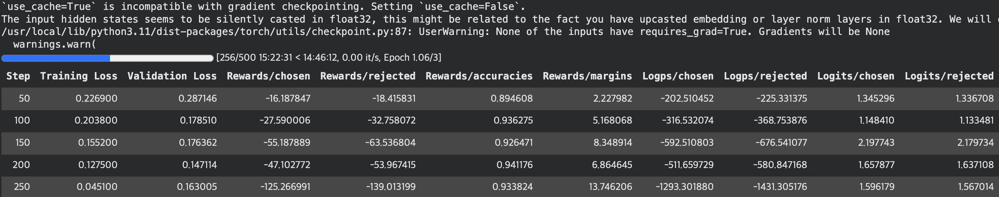

# korean-review-deobfuscation
Korean obfuscated review restoration using QLoRA SFT + DPO | DACON Top 9%

# 난독화된 한글 리뷰 복원 AI

> **[DACON] 난독화된 한글 리뷰 복원 및 생성 AI 경진대회** 참가 코드  
> 월간 데이콘 | NLP | 생성형 AI | LLM | 평가지표: F1 Score
> 🏆 최종 순위: 25등 / 291팀 | F1 Score: 0.83332

---

## 대회 개요

해외 숙소 예약 사이트에서는 부정적인 리뷰가 삭제될 수 있어, 한국인 이용자들이 리뷰를 의도적으로 난독화하는 방식이 등장했습니다.  
이번 대회는 이렇게 난독화된 한글 리뷰를 원문으로 정확하게 복원하는 AI 알고리즘을 개발하는 것을 목표로 합니다.

**난독화 예시**
```
원문: 뿡겋툐 얘픈교 축편또 씩끌럽쥐 안았썼 좋향욥. 땀만 쩡쇽꺄 야쭈 칼큼햐친는 안코 륨 솝퓸틂의 딨떼잃위 졺 떪었짚뉠따.
난독화: 풍경도 예쁘고 주변도 시끄럽지 않아서 좋아요. 다만 청소가 아주 깔끔하지는 않고 룸 소품들의 디테일이 좀 떨어집니다.
```

---

## 접근 방법

**SFT → DPO** 2단계 파이프라인으로 학습을 진행했습니다.

```
[1] Selenium 데이터 증강 (sft_preprocessing)
          ↓
[2] SFT 학습 — 1,100 steps (sft_finetuning)
    Llama 3.1 기반 한국어 모델 / QLoRA r=16
          ↓
[3] DPO 데이터셋 구축 (dpo_preprocessing)
    LLM 리뷰 생성 → 난독화 크롤링 → Hard Negatives 추출
          ↓
[4] DPO 학습 — 500 steps (dpo_finetuning)
    SFT 체크포인트 기반 선호도 학습 / QLoRA r=32
```

---

## 파이프라인 상세

### Step 1 — SFT 데이터 증강 (`sft_preprocessing.ipynb`)

대회 제공 `train.csv`의 원문을 난독화 사이트([airbnbfy.hanmesoft.com](https://airbnbfy.hanmesoft.com/))에 Selenium으로 자동 입력하여 SFT 학습용 쌍 데이터를 수집했습니다.

- **1차 증강** `run_convert_with_range()` — 슬라이더 4개(연음, 중복 자음, 발음 변환, 받침 추가) 범위를 지정해 체계적 순회
- **2차 증강** `run_convert_with_random()` — `[50, 60, 70, 80, 90, 100]` 중 무작위 조합으로 문장당 3회 반복
- **최종 데이터**: 원본 + 3종 증강본 결합 → 중복 제거 후 약 34,000개

### Step 2 — SFT 학습 (`sft_finetuning.ipynb`)

| 항목 | 설정 |
|------|------|
| 베이스 모델 | `AIDX-ktds/ktdsbaseLM-v0.13-onbased-llama3.1` |
| 학습 방식 | QLoRA — 4bit NF4 양자화 + LoRA |
| LoRA | r=16, lora_alpha=32, Attention + FFN 전체 레이어 |
| 학습 steps | 1,100 steps |
| 유효 배치 크기 | 32 (per_device=2 × gradient_accumulation=16) |
| 학습률 | 1e-4 (`constant_with_warmup`) |
| 프롬프트 포맷 | Alpaca (`### Instruction` / `### Response`) |
| Loss 마스킹 | `DataCollatorForCompletionOnlyLM` — Response 이후만 학습 |
| Attention | Flash Attention 2 |

**Training Curve**


### Step 3 — DPO 데이터셋 구축 (`dpo_preprocessing.ipynb`)

SFT 모델이 기존 학습 데이터에서만 DPO 학습을 하면 편향이 고착화되는 문제를 방지하기 위해, LLM 기반 새 리뷰를 생성하고 이를 추가로 혼합하여 더 넓은 도메인에서 Hard Negatives를 확보했습니다.

**전체 흐름**

| 단계 | 작업 | 출력 |
|------|------|------|
| 1단계 | LLM(`llama-3-Korean-Bllossom-8B`)으로 새 리뷰 생성 | `DPO_aug_data.csv` |
| 2단계 | LLM 출력 잔여 태그 제거 + 리스트 파싱 | `DPO_aug_data_pre.csv` |
| 3단계 | 수동 검수 + flatten + 중복 제거 | `DPO_aug_data_cleaned_duplicate_drop.csv` |
| 4단계 | 난독화 크롤링 (3회 실행) | `DPO_aug_pre_final1~3.csv` |
| 5단계 | SFT 모델 추론 → Hard Negatives 추출 → DPO 데이터셋 구성 | `DPO_dataset_final.csv` |

**Hard Negatives 필터링 기준**
1. `output != inference` — 틀리게 예측한 행만
2. `inference` 중복 제거 — 동일한 오답 패턴 제거
3. `len(output) != len(inference)` — 길이까지 다른 확실한 오답만

### Step 4 — DPO 학습 (`dpo_finetuning.ipynb`)

| 항목 | 설정 |
|------|------|
| 베이스 모델 | SFT 최종 체크포인트 (`checkpoint1100`) |
| 참조 모델 | 동일 SFT 체크포인트 — DPO loss 계산 기준점 |
| LoRA | r=32, lora_alpha=64 (SFT r=16 → 표현력 확장) |
| 학습률 | 5e-5 (SFT 대비 낮게 설정) |
| beta | 0.1 — 참조 모델로부터 벗어나는 정도 조절 |
| 학습 steps | 500 steps |

**Training Curve**


---

## 파일 구성

```
├── sft_preprocessing.ipynb   # Step 1: Selenium 데이터 증강
├── sft_finetuning.ipynb      # Step 2: SFT 학습 + vLLM 추론
├── dpo_preprocessing.ipynb   # Step 3: DPO 데이터셋 구축
├── dpo_finetuning.ipynb      # Step 4: DPO 학습 + vLLM 추론
├── requirements.txt
└── README.md
```

> **데이터**: 대회 규정에 따라 `train.csv` 및 증강 CSV 파일은 포함하지 않습니다.

---

## 환경 설정

```bash
pip install -r requirements.txt
```

> 노트북은 Google Colab 환경 기준으로 작성되었습니다.  
> `BASE_DIR`, `CKPT_DIR` 등 경로 변수는 실행 환경에 맞게 수정하세요.

---

## 사용 라이브러리

- [Transformers](https://github.com/huggingface/transformers) — 모델 로드 및 학습
- [TRL](https://github.com/huggingface/trl) — SFTTrainer, DPOTrainer
- [PEFT](https://github.com/huggingface/peft) — QLoRA 어댑터
- [BitsAndBytes](https://github.com/bitsandbytes-foundation/bitsandbytes) — 4bit 양자화
- [vLLM](https://github.com/vllm-project/vllm) — 빠른 배치 추론
- [Selenium](https://www.selenium.dev/) — 데이터 증강 자동화
